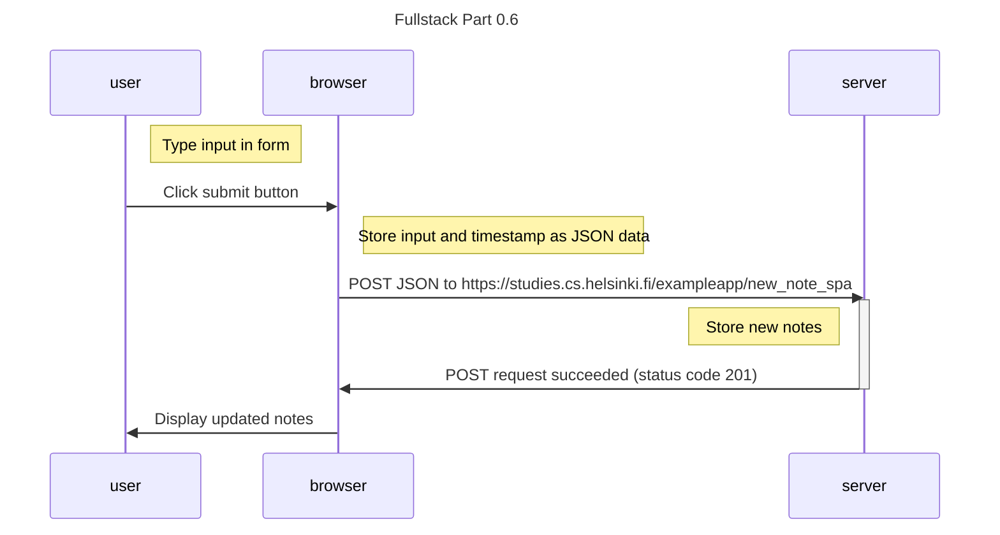

Title: Fullstack Part 0.6

Description: A sequence diagram depicting the situation where the user creates a new note using the single-page version of the app (https://studies.cs.helsinki.fi/exampleapp/spa).

Author: Kasper Vesalainen

